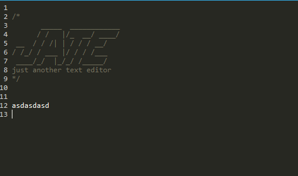
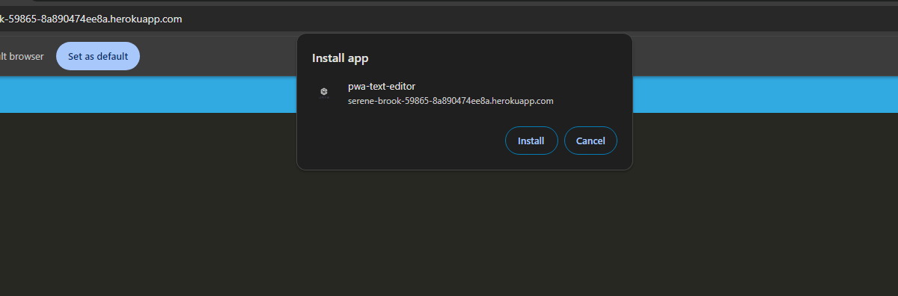

# pwa_text_editor

## Muhsin Tarik Orgerim

  ## Table of Contents
  - [Description](#description)
  - [Usage](#usage)
  - [License](#license)
  - [Credits](#credits)
  - [Contribute](#contribute)
  

  ## Visuals
  
  
 

  # Description
  A PWA text editor that helps user to edit text.

  ## Usage
  A text editor with pwa functionality, can be used online , installed as an app. Offline version still provides user some functionality to keep them on website.
  ## Installation
  N/A

  ## Credits
  - Rutgers Bootcamp Resources.

  ## Contribute
  - Create a fork of the project
  - Create your branch
  - Make sure to commit your changes
  - Push the branch
  - Do a Pull Request

  ## Deployment
  - Link to my repo: https://github.com/tarikorg/pwa_text_editor
  - Deployed link: [SERVER](https://serene-brook-59865-8a890474ee8a.herokuapp.com/)
   
  ## Questions
  - Github username: https://github.com/tarikorg
  - Email: myku1771@gmail.com

  ## License
  This repository is under the MIT license.
